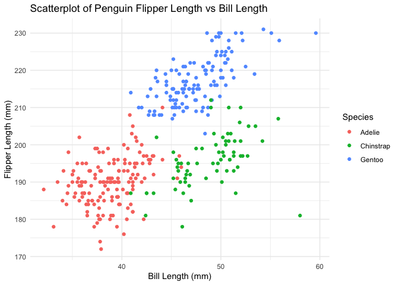

p8105_hw1_ys3766
================
Yifan Shi
2024-09-21

The purpose of this file is to present my work for Homework 1

## Problem 1

Load the penguins dataset

``` r
data("penguins", package = "palmerpenguins")
```

Describe the dataset

``` r
str(penguins)
```

    ## tibble [344 × 8] (S3: tbl_df/tbl/data.frame)
    ##  $ species          : Factor w/ 3 levels "Adelie","Chinstrap",..: 1 1 1 1 1 1 1 1 1 1 ...
    ##  $ island           : Factor w/ 3 levels "Biscoe","Dream",..: 3 3 3 3 3 3 3 3 3 3 ...
    ##  $ bill_length_mm   : num [1:344] 39.1 39.5 40.3 NA 36.7 39.3 38.9 39.2 34.1 42 ...
    ##  $ bill_depth_mm    : num [1:344] 18.7 17.4 18 NA 19.3 20.6 17.8 19.6 18.1 20.2 ...
    ##  $ flipper_length_mm: int [1:344] 181 186 195 NA 193 190 181 195 193 190 ...
    ##  $ body_mass_g      : int [1:344] 3750 3800 3250 NA 3450 3650 3625 4675 3475 4250 ...
    ##  $ sex              : Factor w/ 2 levels "female","male": 2 1 1 NA 1 2 1 2 NA NA ...
    ##  $ year             : int [1:344] 2007 2007 2007 2007 2007 2007 2007 2007 2007 2007 ...

``` r
ncol(penguins)
```

    ## [1] 8

``` r
nrow(penguins)
```

    ## [1] 344

``` r
summary(penguins)
```

    ##       species          island    bill_length_mm  bill_depth_mm  
    ##  Adelie   :152   Biscoe   :168   Min.   :32.10   Min.   :13.10  
    ##  Chinstrap: 68   Dream    :124   1st Qu.:39.23   1st Qu.:15.60  
    ##  Gentoo   :124   Torgersen: 52   Median :44.45   Median :17.30  
    ##                                  Mean   :43.92   Mean   :17.15  
    ##                                  3rd Qu.:48.50   3rd Qu.:18.70  
    ##                                  Max.   :59.60   Max.   :21.50  
    ##                                  NA's   :2       NA's   :2      
    ##  flipper_length_mm  body_mass_g       sex           year     
    ##  Min.   :172.0     Min.   :2700   female:165   Min.   :2007  
    ##  1st Qu.:190.0     1st Qu.:3550   male  :168   1st Qu.:2007  
    ##  Median :197.0     Median :4050   NA's  : 11   Median :2008  
    ##  Mean   :200.9     Mean   :4202                Mean   :2008  
    ##  3rd Qu.:213.0     3rd Qu.:4750                3rd Qu.:2009  
    ##  Max.   :231.0     Max.   :6300                Max.   :2009  
    ##  NA's   :2         NA's   :2

``` r
mean(penguins$flipper_length_mm, na.rm = TRUE)
```

    ## [1] 200.9152

The ‘penguins’ is a dataset from the ‘palmerpenguins’ package. It
includes 344 observations and 8 variables. It contains variable
“species”, “island”, “bill_length_mm”, “bill_depth_mm”,
“flipper_length_mm”, “body_mass_g”, “sex” and “year”.

The dataset contains data for 344 penguins of 3 species, namely Adelie,
Chinstrap and Gentoo. They are from 3 different islands, Biscoe, Dream
and Torgersen. The mean flipper length of the penguins is 200.9mm.

Scatterplot of flipper_length_mm vs bill_length_mm:

``` r
ggplot(penguins, aes(x = bill_length_mm, y = flipper_length_mm, color = species)) + 
    geom_point()+
  labs(title = "Scatterplot of Penguin Flipper Length vs Bill Length",
       x = "Bill Length (mm)",
       y = "Flipper Length (mm)",
       color = "Species")+
  theme_minimal()
```

    ## Warning: Removed 2 rows containing missing values or values outside the scale range
    ## (`geom_point()`).

<!-- -->

``` r
ggsave("scatterplot.png")
```

    ## Saving 7 x 5 in image

    ## Warning: Removed 2 rows containing missing values or values outside the scale range
    ## (`geom_point()`).

## Problem 2

Create a data frame

``` r
df_hw1 = tibble(
  norm = rnorm(10),
  vec_logical = norm > 0,
  vec_character = letters[1:10],
  vec_factor = factor(rep(c("one", "two", "three"), length.out = 10))
)
```

Take the mean of each variable

``` r
mean_norm <- mean(pull(df_hw1, norm), na.rm = TRUE)
mean_vec_logical <- mean(pull(df_hw1, vec_logical), na.rm = TRUE)
mean_vec_character <- mean(pull(df_hw1, vec_character), na.rm = TRUE)
```

    ## Warning in mean.default(pull(df_hw1, vec_character), na.rm = TRUE): argument is
    ## not numeric or logical: returning NA

``` r
mean_vec_factor <- mean(pull(df_hw1, vec_factor), na.rm = TRUE)
```

    ## Warning in mean.default(pull(df_hw1, vec_factor), na.rm = TRUE): argument is
    ## not numeric or logical: returning NA

Attempting to take mean of the random sample and logical vector worked,
while attempting to take mean of the character vector and factor vector
failed. I received the following warning message: argument is not
numeric or logical: returning NA

``` r
numeric_logical <- as.numeric(pull(df_hw1, vec_logical))
numeric_character <- as.numeric(pull(df_hw1, vec_character))
```

    ## Warning: NAs introduced by coercion

``` r
numeric_factor <- as.numeric(pull(df_hw1, vec_factor))
```

Logical variables were converted to numeric, with FALSE = 0 and TRUE =
1.

Character variables were not converted to numeric, and NA was returned.

Factor variables were converted to numeric based on the levels assigned,
with one integer representing each level. Although this would allow for
mean calculation, taking the mean of them is not useful unless the
factor levels have meaningful numeric relationship.

This explains why taking the mean of logical vector worked, while that
for character and factor did not work.
